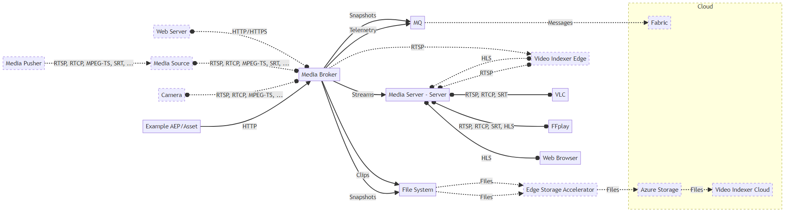

# Azure IoT Operations
# Media Connector
# Private Preview demo package July 2024

## Introduction

This document describes the AIO Media Connector Private Preview demo package and its operations.

The AIO Media Connector is part of the AIO platform. It is designed to be secure, scalable and fault-tolerant. It is responsible for the ingestion, storage, and distribution of media content; it also takes care of the management of media metadata and the generation of media thumbnails.

The demo package contains the following components:
- **AKS cluster (aks-cluster/)**: This directory contains a polyglot notebook that demonstrates how to deploy an Azure Kubernetes Service (AKS) cluster. You can run the demo in an AKS cluster on the cloud.
- **Kubernetes info (kubernetes-info/)**: This directory contains a polyglot notebook that demonstrates how to get information about a Kubernetes cluster.
- **Local container registry (local-container-registry/)**: This directory contains a polyglot notebook that demonstrates how to create a local container registry. This registry can be used to store container images locally.
- **Media Connector Setup (media-connector-setup.dib)**: This DIB file contains the AIO Media Connector setup. It is used to deploy a new AIO Media Connector stand-alone environment.
- **Media Connector mRPC API (media-connector-mrpc-api.dib)**: This DIB file contains the AIO Media Connector mRPC API test.

## Demo environment diagram

The demo environment consists of the following components:

The dotted lines represent connections and components that are possible but not show in the demo package.

## Getting started

First you need to deploy the AIO Media Connector stand-alone environment using the `media-connector-setup.dib` DIB file. Then you can test the mRPC API using the `media-connector-mrpc-api.dib` DIB file.

## Limitations

The AIO Media Connector has the following limitations:
- No discovery, will be implemented by the ONVIF connector, currently under development
- Observability is limited to the logs, no metrics are currently available
- Limits on the number of concurrent connections and the file system use are not enforced
- Performance and footprint are not optimized
