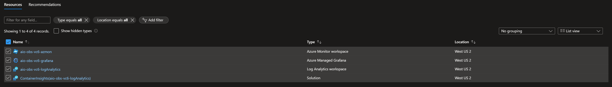
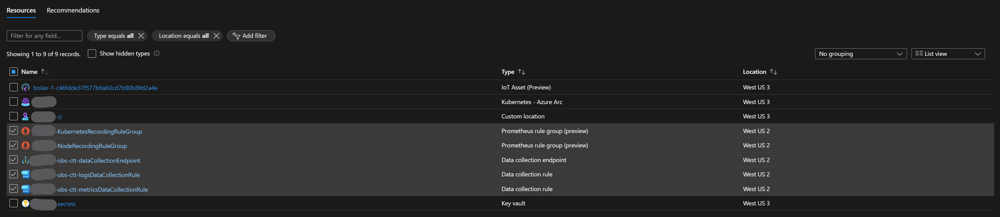

# 3P Observability

This folder has instructions and a script to set up a fresh set of 3P
observability resources for a cluster.

## Setup

### Step 1: Initial Cluster Setup

1. Run the following to register providers with the subscription where your
   cluster is located:

   ```
   az account set -s <subscription-id>
   az provider register -n "Microsoft.Kubernetes"
   az provider register -n "Microsoft.Insights"
   az provider register -n "Microsoft.AlertsManagement"
   ```

2. Set up the scrape config. This can either be done directly from your
   Arc-enabled kubernetes cluster or from another machine.

   > NOTE: If you run the next command from another machine, be sure to run this
   > command first to connect to your Arc-enabled kubernetes cluster:
   >
   > ```
   > az connectedk8s proxy -n <cluster-name> \
   >                       -g <cluster-resource-group> \
   >                       --subscription <cluster-subscription>
   > ```
   >
   > You may also find that when running the below command from a remote machine
   > you get an access denied error. If that's the case, you need to make sure
   > you have permissions to perform the correct operations on the cluster. To
   > give yourself full permissions, run this from your Arc-enabled Kubernetes
   > cluster:
   >
   > ```
   > kubectl create clusterrolebinding <your-username>-admin --clusterrole cluster-admin --user=<your-email>
   > ```

   ```
   kubectl apply -f ama-metrics-prometheus-config.yaml --context <cluster-context>
   ```

   or if your cluster's context is the default context:

   ```
   kubectl apply -f ama-metrics-prometheus-config.yaml
   ```

### Step 2: Deploy Resources

The observability resources used by Azure IoT Operations fall into two general
groups:

1. Shared observability resources for monitoring multiple clusters
2. Cluster-specific resources created for each cluster that you want to monitor

These resources can be created together in a single deployment or can be created
via separate deployments, depending on how you want to organize your
observability resources. The options are:

- [All-in-one Deployment](#all-in-one-deployment) - creates all of the resources
  needed for monitoring a cluster from scratch. Useful if you're just getting
  started and want to set up a single cluster with a new set of observability
  resources
- [Shared Resource Deployment](#shared-resource-deployment) - creates only the
  shared observability resources. Useful for setting up shared resources
  independently from connecting clusters to those resources
- [Cluster Resource Deployment](#cluster-resource-deployment) - connects a
  cluster to an existing set of shared observability resources created via one
  of the other deployment types. Useful for adding additional clusters to a
  single set of shared resources

#### All-in-one Deployment

This deployment sets up both shared monitoring resources (i.e. Azure Managed
Grafana, Azure Monitor, Azure Log Analytics) and connects the specified cluster
to those resources.

To deploy, run this command, using the subscription id and resource group of the
pre-existing Arc-enabled cluster that you want to monitor.

> NOTE: Additional parameters may be specified by reading through the
> [bicep file](./observability-full.bicep). The optional parameters can specify
> things like alternative locations for cluster resources.

```
az deployment group create \
      --subscription <subscription-id> \
      --resource-group <cluster-resource-group> \
      --template-file observability-full.bicep \
      --parameters grafanaAdminId=$(az ad user show --id $(az account show --query user.name --output tsv) --query=id --output tsv) \
                   clusterName=<cluster-name> \
                   sharedResourceGroup=<shared-resource-group> \
                   sharedResourceLocation=<shared-resource-location> \
      --query=properties.outputs
```

> NOTE: the above command grants admin access for the newly created Grafana
> instance to the user who runs it. If this is not desired, the following
> command can be run instead (permissions will have to be set up manually before
> anyone can access the Grafana instance).
>
> ```
> az deployment group create \
>     --subscription <subscription-id> \
>     --resource-group <cluster-resource-group> \
>     --template-file observability-full.bicep \
>     --parameters clusterName=<cluster-name> \
>                  sharedResourceGroup=<shared-resource-group> \
>                  sharedResourceLocation=<shared-resource-location> \
>     --query=properties.outputs
> ```
>
> To set up permissions manually,
> [add a role assignment](https://learn.microsoft.com/en-us/azure/managed-grafana/how-to-share-grafana-workspace?tabs=azure-portal#add-a-grafana-role-assignment)
> to the Grafana for the user(s) that should have access and assign one of the
> Grafana roles (Grafana Admin, Grafana Editor, Grafana Viewer) depending on the
> level of access desired.

If the deployment succeeded, a few pieces of information will be printed at the
end of the command output. These include the Grafana URL and the resource ids
for both the Log Analytics and Azure Monitor resources that were created. The
Grafana URL allows you to navigate to the Grafana instance that you configure in
[Step 3](#step-3-access-grafana-dashboards). The other two pieces of information
are needed if you want to set up additional clusters via the
[Cluster Resource Deployment](#cluster-resource-deployment).

#### Shared Resource Deployment

This deployment sets up the shared monitoring resources (i.e. Azure Managed
Grafana, Azure Monitor, Azure Log Analytics), but does not connect it to any
clusters. After running this deployment, use the
[Cluster Resource Deployment](#cluster-resource-deployment) to set up monitoring
of your cluster(s) using the shared resources.

To deploy, run this command, using the subscription id and resource group where
you want the observability resources to exist (the resource group must already
exist). This only needs to be run once per monitoring environment that you would
like to use:

> NOTE: Additional parameters may be specified by reading through the
> [bicep file](./observability.bicep). The optional parameters can specify
> things like alternative locations for shared resources.

```
az deployment group create \
      --subscription <subscription-id> \
      --resource-group <resource-group> \
      --template-file observability.bicep \
      --parameters grafanaAdminId=$(az ad user show --id $(az account show --query user.name --output tsv) --query=id --output tsv) \
      --query=properties.outputs
```

> NOTE: the above command grants admin access for the newly created Grafana
> instance to the user who runs it. Depending on how your tenant is configured,
> the command may be required to run from a managed machine. If you dont't have
> a managed machine or you don't want to add yourself as a Grafana admin, you
> can run the following command instead (permissions will have to be set up
> manually before anyone can access the Grafana instance).
>
> ```
> az deployment group create \
>     --subscription <subscription-id> \
>     --resource-group <resource-group> \
>     --template-file observability.bicep \
>     --query=properties.outputs
> ```
>
> To set up permissions manually,
> [add a role assignment](https://learn.microsoft.com/en-us/azure/managed-grafana/how-to-share-grafana-workspace?tabs=azure-portal#add-a-grafana-role-assignment)
> to the Grafana for the user(s) that should have access and assign one of the
> Grafana roles (Grafana Admin, Grafana Editor, Grafana Viewer) depending on the
> level of access desired.

If the deployment succeeded, a few pieces of information will be printed at the
end of the command output. These include the Grafana URL and the resource ids
for both the Log Analytics and Azure Monitor resources that were created. The
Grafana URL allows you to navigate to the Grafana instance that you configure in
[Step 3](#step-3-access-grafana-dashboards). The other two pieces of information
are needed if you want to set up additional clusters via the
[Cluster Resource Deployment](#cluster-resource-deployment).

#### Cluster Resource Deployment

This deployment configures observability for our individual cluster to enable
telemetry to be sent to the shared resources deployed via either the
[All-in-one Deployment](#all-in-one-deployment) or
[Shared Resource Deployment](#shared-resource-deployment).

To deploy, run the following command, using the resource ids that were output
from the previous deployment for the relevant parameters:

```
az deployment group create \
      --subscription <cluster-subscription-id> \
      --resource-group <cluster-resource-group> \
      --template-file cluster.bicep \
      --parameters clusterName=<cluster-name> \
                  azureMonitorId=<azure-monitor-resource-id> \
                  logAnalyticsId=<log-analytics-resource-id>
```

If your Azure Monitor and/or Log Analytics are in a different region than your
cluster, the above command will produce an error. To resolve this, pass the
additional `azureMonitorLocation` and `logAnalyticsLocation` parameters:

```
az deployment group create \
      --subscription <cluster-subscription-id> \
      --resource-group <cluster-resource-group> \
      --template-file cluster.bicep \
      --parameters clusterName=<cluster-name> \
                  azureMonitorId=<azure-monitor-resource-id> \
                  logAnalyticsId=<log-analytics-resource-id> \
                  azureMonitorLocation=<azure-monitor-location> \
                  logAnalyticsLocation=<log-analytics-location>
```

### Step 3: Access Grafana Dashboards

Navigate to the endpoint for the Grafana instance created earlier using the URL
from the deployment outputs. If you have not previously done so, create the
relevant dashboards by going to the
[dashboard list](https://github.com/Azure/azure-iot-operations/tree/main/samples/grafana-dashboards).
For each dashboard in the list that you want, import it into the Grafana
workspace via the add (+) button in the upper right of the Grafana UI.

## Cleanup

If you want to uninstall the resources created by these scripts, first navigate
to the resource group where you installed the shared resources and delete the
following resources:

- Azure Monitor Workspace
- Azure Managed Grafana
- Log Analytics Workspace
- Container Insights Solution

In addition, for any clusters that you have set up, you will want to delete the
following two Prometheus rule groups:

- \<cluster-name\>-KubernetesRecordingRuleGroup
- \<cluster-name\>-NodeRecordingRuleGroup

For a resource group with a single cluster connected, this is what the list of
resources will look like:



Next, navigate to the resource group where your cluster is located (if different
from the resource group for the previous resources). Once there, find the data
collection endpoint and two data collection rules (one ending with
"logsDataCollectionRule" and the other ending with "metricsDataCollectionRule").
Delete these three resources to complete the cleanup without removing the
cluster itself or any of its rules.

> NOTE: The delete may need to be run more than once for all resources to be
> successfully deleted

For a typical cluster resource group, this is what the list of resources might
look like (resources to delete are selected):



Finally, you can remove the configuration that was installed on your cluster by
running this command from your cluster:

```
kubectl delete -f ama-metrics-prometheus-config.yaml --context <cluster-context>
```

or if your cluster's context is the default context:

```
kubectl delete -f ama-metrics-prometheus-config.yaml
```